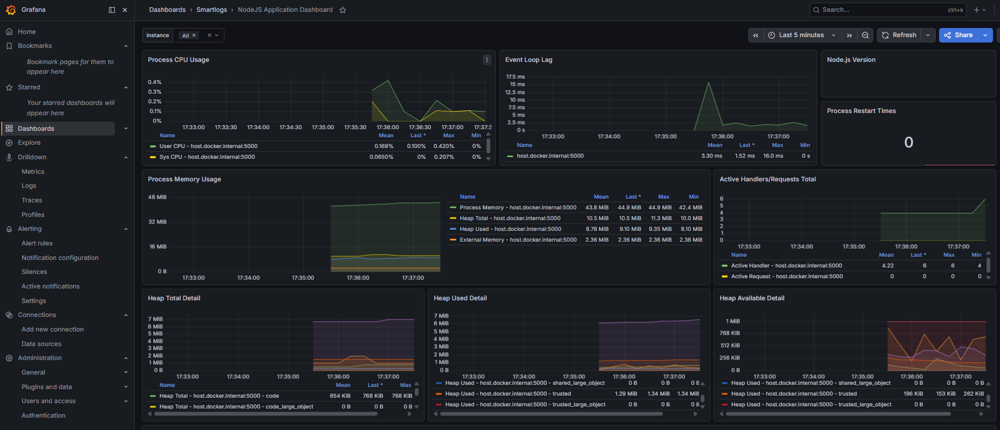
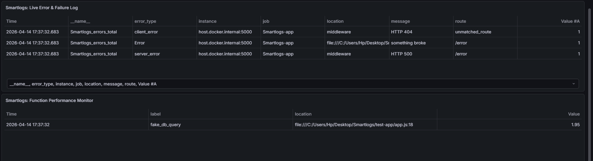

<div align="center">
  <h1>SmartLogs</h1>
  <p><strong>The "Zero-Config" Monitoring Toolkit for Node.js</strong></p>
  
  [](https://opensource.org/licenses/MIT)
  [](https://nodejs.org/)
  [](http://makeapullrequest.com)

  <p>
    Deploy a professional-grade Prometheus & Grafana monitoring stack in 60 seconds. 
    Add one line of code to your Express app and achieve absolute observability.
  </p>

  <br />
  <!-- Replace this URL with a real screenshot of your Grafana Dashboard -->
  
</div>

<hr />

## Why SmartLogs?

Backend monitoring is notoriously difficult to configure. Traditional setups require days of tuning Prometheus exporters, matching Grafana UIDs, and handling Node.js memory leaks. **SmartLogs connects everything out of the box.**

- **Instant App Health:** Zero-config CPU, Memory, and Uptime telemetry.
- **Route Tracking:** Auto-tracks HTTP traffic, P95 latency, and 4xx/5xx error rates.
- **"Pin-Point" Error Location:** Automatically reverse-engineers stack traces to display the exact file and line number (e.g., `app.js:42`) of every crash directly on the dashboard.
- **Bottleneck Profiler:** Wrap any heavy code block in `trackPerformance()` to strictly track its 95th Percentile latency.
- **Secure by Default:** Aggressively protects your application from memory-crashing "Cardinality Explosions" triggered by malicious bot routing.

---

## Quick Start

### 1. Launch the Dashboard
Clone this repository and spin up the Docker-based monitoring stack:

```bash
git clone https://github.com/Taranikrish/smartlogs.git
cd smartlogs
cp .env.example .env  # Update your passwords in this file!
docker-compose up -d
```
*Your Grafana dashboard is now live at [http://localhost:3058](http://localhost:3058) (Login: `admin` / Password from `.env`).*

### 2. Install the Client
In your existing Node.js/Express project:
```bash
npm install smartlogs
```

### 3. Add to your App (`app.js`)
```javascript
import express from 'express';
// 1. Import Smartlogs
import { init, middleware, metricsEndpoint } from 'smartlogs';

const app = express();

// 2. Initialize monitoring and expose the /metrics route
init();
app.get('/metrics', metricsEndpoint());

// 3. Add the middleware to track all routes automatically
app.use(middleware());

app.get('/', (req, res) => res.send('Hello World!'));
app.listen(5000);
```

---

## Comprehensive API Reference

### 1. `init()`
**What it does:** Initializes the SmartLogs monitoring engine and binds to default Node.js metrics (CPU, Memory, Event Loop Lag, and Garbage Collection).  
**When to use it:** You must call this exactly once when your server starts up.  
```javascript
import { init } from 'smartlogs';
init();
```

### 2. `metricsEndpoint()`
**What it does:** Returns an async Express handler that exposes all your collected metrics in the standard Prometheus exposition format.  
**When to use it:** Bind this to a secure route (usually `/metrics`) so your Prometheus instance can scrape the data.  
```javascript
import express from 'express';
import { metricsEndpoint } from 'smartlogs';

const app = express();
app.get('/metrics', metricsEndpoint());
```

### 3. `middleware()`
**What it does:** A plug-and-play Express middleware that automatically tracks Total Requests, HTTP Response Status Codes (200, 404, 500, etc.), and endpoint Latency. It aggressively protects against memory leaks (Cardinality Explosions) by grouping malicious or unmapped 404 routes under a single `'unmatched_route'` bucket.  
**When to use it:** Add it right after your `/metrics` endpoint, but *before* your actual application routes.  
```javascript
import { middleware } from 'smartlogs';
app.use(middleware()); // That's it! All downstream traffic is now tracked.
```

### 4. `trackPerformance(label, asyncFunction)`
**What it does:** A highly optimized bottleneck profiler. It executes your asynchronous code block, tracks exactly how long it took resolving down to the millisecond, and automatically captures the exact file and line number it was executed on.  
**When to use it:** Wrap database queries, external API calls, or heavy CPU operations to identify exactly what is slowing down your server.  
**Parameters:**
- `label` (String): A custom name for this block (e.g., `'fetch_user_profile'`).
- `asyncFunction` (Function): The asynchronous logic to execute.
```javascript
import { trackPerformance } from 'smartlogs';

app.get('/heavy-task', async (req, res) => {
  const data = await trackPerformance('db_giant_query', async () => {
      // The time it takes to run this line will be recorded!
      return await db.query('SELECT * FROM giant_table');
  });
  
  res.json(data);
});
```

### 5. `logError(error, { route })`
**What it does:** Manually logs structured application crashes and exceptions. It reverse-engineers the error's stack trace to extract the exact file name and line number, pushing it directly to your Grafana incident dashboard.  
**When to use it:** Inside your `try/catch` blocks or global error handlers.  
**Parameters:**
- `error` (Error Object): The caught exception.
- `meta.route` (String): The route or context where the crash happened.
```javascript
import { logError } from 'smartlogs';

app.post('/checkout', async (req, res) => {
  try {
    await processPayment();
  } catch (err) {
    logError(err, { route: '/checkout' });
    res.status(500).send('Payment failed');
  }
});
```

### 6. `trackFailure({ route, reason, severity })`
**What it does:** Tracks business-logic failures that *aren't* crashes. It logs the event and automatically tags the file and line number where the failure occurred.  
**When to use it:** When a user enters a wrong password, hits a rate limit, or triggers a validation error.  
**Parameters:**
- `route` (String): Where it happened.
- `reason` (String): Why it happened (e.g., `'invalid_password'`).
- `severity` (String): `'low'`, `'medium'`, or `'high'`.
```javascript
import { trackFailure } from 'smartlogs';

if (password !== user.password) {
  trackFailure({ route: '/login', reason: 'invalid_password', severity: 'low' });
  return res.status(401).send('Unauthorized');
}
```
<hr>
<div align="center">
<h2>Custom Log</h2>

</div>

### 7. `trackRoute(req, res, responseTimeMs)`
**What it does:** Manually tracks an HTTP route's performance.  
**When to use it:** Only use this if you are NOT utilizing `middleware()` and want to build your own custom Express measurement interceptor.  
```javascript
import { trackRoute } from 'smartlogs';

// Usually called inside a custom middleware's res.on('finish') event
trackRoute(req, res, 150); 
```

---

## Production Deployment Strategies

When deploying your Node.js application to a real server (AWS, DigitalOcean, Heroku), Prometheus needs to know where to pull the metrics from. Update `smartlog-prom/prometheus.yml` to fit your architecture.

### Recommended: The Secure Internal Method
For maximum security, keep your `/metrics` endpoint hidden from the public internet. If both your API and Prometheus are running on the same network environment, target the hidden internal HTTP port directly (bypassing Nginx or your Load Balancer):

```yaml
scrape_configs:
  - job_name: 'Smartlogs-app'
    static_configs:
      - targets: ['127.0.0.1:5000'] # Points securely to the hidden backend port
```

> [!CAUTION]
> ### The Public URL Method (Not Recommended)
> If you are hosting Prometheus on a completely different network, you can configure it to scrape your public URL (e.g., `api.yourwebsite.com/metrics`). However, doing this leaves your system metrics entirely exposed to the public internet unless you configure token authentication on that specific route.

---

<div align="center">
  <b>Built for the open-source community by <a href="https://github.com/Taranikrish">Krish Tarani</a></b>
</div>
